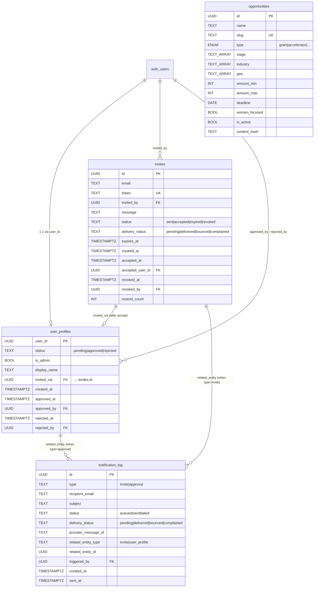
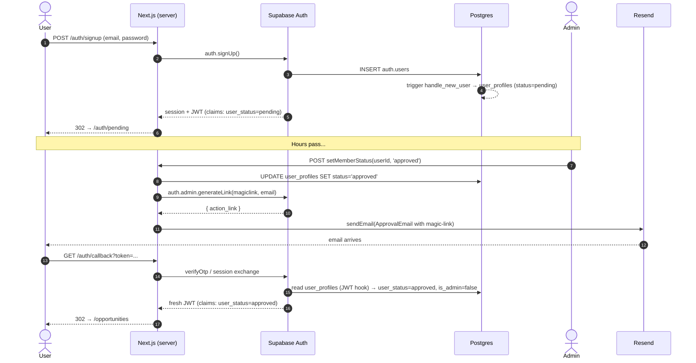
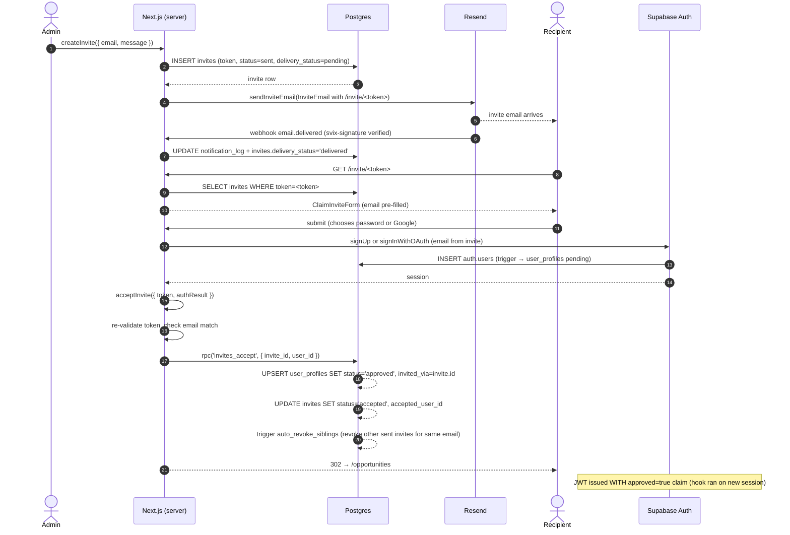
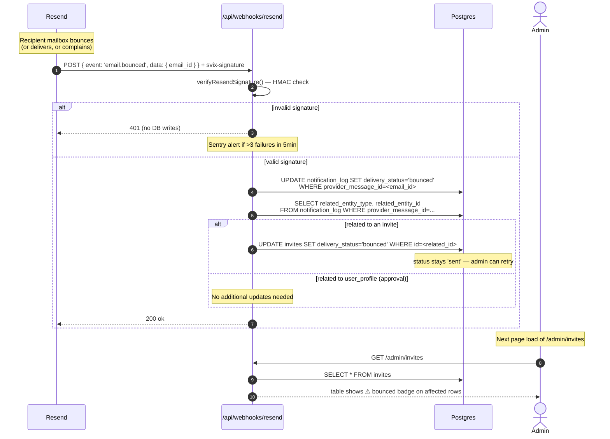

# Hearth — Foundation Design (v1)

> Date: 2026-05-22
> Status: Draft — pending Shree's spec review
> Companion docs: [`01-as-is-and-breaking.md`](./01-as-is-and-breaking.md) (current state, problems being solved)
> Future companion: `03-radar.md`, `04-phase3-saved-opps.md`, `05-ai-layer.md`, `06-ops-plumbing.md` (one per Phase B/C sub-project)
> Implementation: written into a plan via `superpowers:writing-plans` skill after this spec is approved.

---

## TL;DR

Hearth v1 is an **invite-only login portal for scraped funding opportunities**. Everything else (Phase 2 community-manager dashboard, Phase 3 founder personalization, AI layer) is out of scope or deferred.

This spec describes:
1. **Five bounded domains** — `identity`, `invites`, `radar`, `admin`, `notifications` — each with its own schema, queries, components, RLS, and migrations.
2. **A `src/domains/<name>/` repo reorganization** that replaces today's flat `src/lib/`+`src/app/`+`src/components/` arrangement.
3. **JWT-claim-based access control** replacing the current 2-DB-hits-per-request middleware.
4. **A real `invites` table with full lifecycle** (sent / accepted / expired / revoked, with auto-revoke siblings on accept).
5. **A `notifications` domain wrapping Resend** for invite emails, approval magic-links, and Resend bounce/complaint webhook ingestion.
6. **Tightened radar access**: schema moves to a `radar.` namespace, public-read RLS dropped, replaced by `approved`-only RLS + a single `get_public_stats` RPC for the landing-page counter.
7. **A staged migration plan** with rollback paths and a 24-hour soak before Phase 2 teardown.
8. **Full free-tier compliance** — $0/mo total external service cost.

What this spec **does not** cover:
- Phase 3 founder features (saved opportunities, application tracker, recommendations) — design extension points exist; concrete tables / UI are a separate spec.
- AI layer (Workstream A: tagger, summaries, embeddings) — deferred entirely.
- Tagger improvements for the existing rule-based classifier — tracked as Task #8, scoped to Phase B radar work.
- Audit log expansion beyond `notification_log`.

---

## 1. High-Level Architecture & Code Layout

### 1.1 Five domains

| Domain | Responsibility | Owns tables |
|---|---|---|
| **identity** | Sessions, auth providers, JWT custom claims, middleware gate, user profile state machine | `identity.user_profiles` |
| **invites** | Pre-issued invite tokens, magic-link generation, accept flow, admin lifecycle | `invites.invites` |
| **radar** | Opportunities data access, filters, opportunity detail | `radar.opportunities` (read-only from app; writes from scrapers) |
| **admin** | Admin overview, member queue, invite management UI | none — orchestrates other domains |
| **notifications** | Email send (Resend) + audit log + Resend bounce/complaint webhook | `notifications.notification_log` |

**Rules between domains**:
- `admin` is the only domain that may call across all others' public interfaces.
- `invites` calls `notifications` (for send) and `identity` (to insert pre-approved profile on accept).
- `identity` calls nothing else; it is the trust root.
- `radar` calls nothing else; it just reads `opportunities` (gated by middleware in `identity`).
- `notifications` calls nothing else; it's a pure utility.

### 1.2 Repo layout

```
src/
  app/                          # Next.js routes — thin handlers, delegate to domains
    (public)/
      page.tsx                  # landing + "Request Access" form
      privacy/page.tsx
    auth/                       # login, signup, callback, pending, signout
    admin/                      # overview, members, invites (no /admin/login)
    opportunities/              # radar list
    opp/[slug]/                 # radar detail
    invite/[token]/             # invite accept landing (PUBLIC)
    api/
      webhooks/resend/          # Resend bounce/complaint webhook (Section 4.5)

  domains/
    identity/                   # M3 successor
    invites/                    # NEW
    radar/                      # M1 + M4 successor
    admin/                      # M6 successor
    notifications/              # NEW

  components/ui/                # shadcn primitives only
  lib/                          # truly cross-cutting
    utils.ts
    constants.ts
    supabase/                   # client/server/admin Supabase clients
  middleware.ts                 # imports from domains/identity

supabase/
  migrations/
    # NOTE: Supabase CLI's migration runner picks up `*.sql` files in the
    # top level of supabase/migrations/ only — subdirectories are ignored.
    # If that ever changes, rename legacy/ to .archive/ (dot-prefix).
    legacy/                     # 001/002/003 archived for reference (won't re-run on fresh DBs)
    00_setup__create_schemas.sql
    identity_001__user_profiles.sql
    identity_002__jwt_custom_claims.sql
    invites_001__invites_table.sql
    invites_002__auto_revoke_trigger.sql
    invites_003__accept_rpc.sql
    notifications_001__notification_log.sql
    radar_001__opportunities_table.sql
    radar_002__private_rls.sql
    radar_003__public_stats_rpc.sql
    teardown_001__drop_phase2.sql

scrapers/                       # Python pipeline — unchanged in layout
  ...
```

### 1.3 Per-domain file convention

```
domains/<name>/
  index.ts                      # public exports
  schema.ts                     # Zod schemas
  db.ts                         # queries + mutations
  actions.ts                    # server actions (if any)
  components/                   # domain-specific UI
  triggers.sql                  # SQL trigger sources (committed; applied by migrations)
  rpc.sql                       # SQL RPC sources (committed; applied by migrations)
  types.ts
  __tests__/
```

### 1.4 Migration prefix scheme

`<domain>_<NNN>__<description>.sql` — e.g. `invites_001__invites_table.sql`. The domain prefix makes ownership obvious. Reset of sequence per domain (each starts at `001`).

Legacy `001/002/003.sql` migrations from the current codebase are moved to `legacy/`. They stay in git history for reference but are excluded from fresh-DB runs.

### 1.5 Layered data flow

```
┌─────────────────────────────────────────────────────────────┐
│ src/app/          (routes — thin handlers, ~20-50 lines)    │
└─────────────────────┬────────────────────────────────────────┘
                      │ calls domain.action() / domain.db.read()
                      ▼
┌─────────────────────────────────────────────────────────────┐
│ src/domains/      (business logic, bounded contexts)         │
│   identity · invites · radar · admin · notifications        │
└─────────────────────┬────────────────────────────────────────┘
                      │ Supabase clients (server / client / admin / middleware)
                      ▼
┌─────────────────────────────────────────────────────────────┐
│ Supabase (Postgres + Auth + RLS + Custom JWT Hook)          │
│   identity.user_profiles · invites.invites                  │
│   radar.opportunities · notifications.notification_log      │
└─────────────────────▲────────────────────────────────────────┘
                      │ writes via service role
┌─────────────────────┴────────────────────────────────────────┐
│ scrapers/    (Python, GitHub Actions, daily 18:00 UTC)      │
│   10 sources → tagger → radar.opportunities                 │
└─────────────────────────────────────────────────────────────┘
```

### 1.6 Entity-relationship diagram



`opportunities` is unlinked from users in v1 (no per-user joins). Phase 3 adds `saved_opportunities` and `founder_recommendations` joining `user_profiles` ↔ `opportunities`.

---

## 2. Identity Domain

### 2.1 `identity.user_profiles` schema

```sql
CREATE TABLE identity.user_profiles (
  user_id        UUID PRIMARY KEY REFERENCES auth.users(id) ON DELETE CASCADE,
  status         TEXT NOT NULL CHECK (status IN ('pending','approved','rejected')),
  is_admin       BOOLEAN NOT NULL DEFAULT false,
  display_name   TEXT,
  invited_via    UUID REFERENCES invites.invites(id),     -- NULL if self-signup
  created_at     TIMESTAMPTZ NOT NULL DEFAULT now(),
  approved_at    TIMESTAMPTZ,
  approved_by    UUID REFERENCES auth.users(id),
  rejected_at    TIMESTAMPTZ,
  rejected_by    UUID REFERENCES auth.users(id)
);
CREATE INDEX idx_user_profiles_status ON identity.user_profiles(status);
```

**Changes from today's `public.user_profiles`:**
- Moves to `identity` schema.
- Adds `invited_via` (audit trail).
- Adds `rejected_at` / `rejected_by` (today only approval is audited).
- Removes the `DEFAULT 'pending'` — INSERT must be explicit (self-signup trigger uses `'pending'`; invite-accept RPC uses `'approved'`).

### 2.2 Trigger: `handle_new_user`

Creates a profile row whenever `auth.users` gets a new entry (covers all signup paths: email/password, OAuth, magic link).

```sql
CREATE OR REPLACE FUNCTION identity.handle_new_user()
RETURNS TRIGGER
LANGUAGE plpgsql
SECURITY DEFINER
SET search_path = identity
AS $$
BEGIN
  INSERT INTO identity.user_profiles (user_id, status, is_admin)
  VALUES (NEW.id, 'pending', false)
  ON CONFLICT (user_id) DO NOTHING;
  RETURN NEW;
END;
$$;

CREATE TRIGGER on_auth_user_created
  AFTER INSERT ON auth.users
  FOR EACH ROW EXECUTE FUNCTION identity.handle_new_user();
```

The invite-accept path inserts directly with `status='approved'` BEFORE this trigger fires (race-safe due to `ON CONFLICT DO NOTHING`).

### 2.3 JWT custom claims (kills the per-request DB lookup)

```sql
CREATE OR REPLACE FUNCTION identity.access_token_hook(event jsonb)
RETURNS jsonb
LANGUAGE plpgsql
SECURITY DEFINER
SET search_path = identity
AS $$
DECLARE
  claims jsonb;
  profile_status text;
  profile_is_admin boolean;
BEGIN
  claims := event->'claims';

  SELECT status, is_admin
    INTO profile_status, profile_is_admin
    FROM identity.user_profiles
    WHERE user_id = (event->>'user_id')::uuid;

  claims := jsonb_set(claims, '{user_status}', to_jsonb(coalesce(profile_status, 'pending')));
  claims := jsonb_set(claims, '{is_admin}', to_jsonb(coalesce(profile_is_admin, false)));

  RETURN jsonb_set(event, '{claims}', claims);
END;
$$;

GRANT EXECUTE ON FUNCTION identity.access_token_hook TO supabase_auth_admin;
```

**Activation**: post-migration, in Supabase Dashboard → Authentication → Hooks → Customize Access Token → select `identity.access_token_hook`. Documented in the cutover checklist.

**Stale-claim handling**: when `setMemberStatus()` flips a profile from `pending` to `approved`, the JWT held by the user's currently-active browser still has `user_status='pending'` claimed inside it. That JWT is valid until its TTL expires (default 1 hour). Two complementary mechanisms close the gap:

1. **Magic-link in ApprovalEmail (primary)** — The server action triggers `notifications.sendApprovalEmail()` (Section 4), which embeds a magic-link generated via `supabase.auth.admin.generateLink({ type: 'magiclink', email })`. When the user clicks it, they get a fresh session with fresh claims. They land on `/opportunities` directly. This is the expected path: user gets the email, clicks, in.

2. **`/auth/pending` page "Check Status" button (fallback)** — For users sitting on `/auth/pending` in an old tab when approval happens: a button that runs `await supabase.auth.refreshSession()` on click. This re-mints the access token using the (still-valid) refresh token; the JWT hook runs again and the new access token carries fresh claims. One click, no email needed.

**Window for stale-claim leakage**: bounded by the access-token TTL. In the worst case a user has a stale 1-hour JWT and stays in the original tab without clicking the email or "Check Status" — they'll see "pending" until the access token expires and refresh fires. Acceptable; benign (they're approved, they just need to click).

Not using `supabase.auth.admin.signOut` — the Supabase Admin JS API's session-invalidation paths are awkward (signOut takes a user JWT, not user ID; the deleteUser path is too destructive). The above two mechanisms cover the practical case with no admin-API gymnastics.

### 2.4 Auth providers

| Provider | Configured | Used by |
|---|---|---|
| Email/password | Supabase Auth (default) | Self-signup, optional set-password in invite-accept |
| Google OAuth | Supabase → Providers → Google | Anyone |
| Magic link / OTP | Supabase Auth (default) | Invite emails, approval emails, passwordless login option |

**Single consolidated `/auth/login`** — no separate `/admin/login` page. Admin chrome lives inside `/admin/*` post-login.

### 2.5 Middleware

```ts
// src/middleware.ts
import { NextResponse, type NextRequest } from "next/server";
import { createMiddlewareClient } from "@/domains/identity/middleware-client";

const PUBLIC_PATHS = ["/", "/privacy"];
const PUBLIC_PREFIXES = ["/auth/", "/invite/", "/_next/", "/api/health", "/api/webhooks/"];

export async function middleware(request: NextRequest) {
  const { pathname } = request.nextUrl;

  // Cron / webhook secret-gated paths
  if (pathname.startsWith("/api/cron/")) {
    const auth = request.headers.get("authorization");
    if (auth !== `Bearer ${process.env.CRON_SECRET}`) {
      return NextResponse.json({ error: "Unauthorized" }, { status: 401 });
    }
    return NextResponse.next();
  }

  if (PUBLIC_PATHS.includes(pathname)) return NextResponse.next();
  if (PUBLIC_PREFIXES.some((p) => pathname.startsWith(p))) return NextResponse.next();

  // Authed paths — read JWT claims, ZERO DB calls
  const { supabase, response } = createMiddlewareClient(request);
  const { data: { session } } = await supabase.auth.getSession();

  if (!session) {
    const url = new URL("/auth/login", request.url);
    url.searchParams.set("redirect", pathname);
    return NextResponse.redirect(url);
  }

  const claims = decodeJwtClaims(session.access_token);
  const status = claims.user_status as string;
  const isAdmin = claims.is_admin as boolean;

  if (status !== "approved") {
    return NextResponse.redirect(new URL("/auth/pending", request.url));
  }

  if (pathname.startsWith("/admin") && !isAdmin) {
    return NextResponse.redirect(new URL("/opportunities", request.url));
  }

  return response;
}

export const config = {
  matcher: ["/((?!_next/static|_next/image|favicon.ico).*)"],
};
```

`decodeJwtClaims` is a base64 decode of the middle segment — no signature verification needed, since Supabase already validated when issuing.

### 2.6 RLS for `user_profiles`

```sql
ALTER TABLE identity.user_profiles ENABLE ROW LEVEL SECURITY;

CREATE POLICY "self_read" ON identity.user_profiles FOR SELECT
  USING (user_id = (SELECT auth.uid()));

CREATE POLICY "self_update_display_name" ON identity.user_profiles FOR UPDATE
  USING (user_id = (SELECT auth.uid()))
  WITH CHECK (
    user_id = (SELECT auth.uid())
    AND status = (SELECT status FROM identity.user_profiles WHERE user_id = (SELECT auth.uid()))
    AND is_admin = (SELECT is_admin FROM identity.user_profiles WHERE user_id = (SELECT auth.uid()))
  );

CREATE POLICY "admin_read_all" ON identity.user_profiles FOR SELECT
  USING ((auth.jwt()->>'is_admin')::boolean IS TRUE);

CREATE POLICY "admin_update_all" ON identity.user_profiles FOR UPDATE
  USING ((auth.jwt()->>'is_admin')::boolean IS TRUE);
```

The old `is_admin()` SECURITY DEFINER function gets dropped — JWT claim replaces it.

### 2.7 State machine

```
                       ┌──────────────────────────┐
                       │  signup via /auth/signup │
                       │  (email/password, Google)│
                       └────────────┬─────────────┘
                                    │
                                    ▼
                       ┌──────────────────────────┐
                       │ identity.handle_new_user │
                       │  status='pending'        │
                       │  invited_via=NULL        │
                       └────────────┬─────────────┘
                                    │
                                    ▼ /auth/pending
                                    │
                                    │  admin → setMemberStatus('approved')
                                    │  → notifications.sendApprovalEmail (magic-link)
                                    │  (stale JWT on old tab handled by
                                    │   "Check Status" button OR by clicking
                                    │   the magic-link in the email)
                                    │
                                    ▼ user clicks magic link
                       ┌──────────────────────────┐
                       │ fresh JWT: approved=true │
                       │ → /opportunities         │
                       └──────────────────────────┘

                       ┌──────────────────────────┐
                       │ /invite/[token] claim    │
                       └────────────┬─────────────┘
                                    │ token valid + not expired
                                    │ user signs up / signs in
                                    │
                                    ▼
                       ┌──────────────────────────┐
                       │ invites_accept RPC       │
                       │ → identity.user_profiles │
                       │   status='approved'      │
                       │   invited_via=invite.id  │
                       │ → invites.invites        │
                       │   status='accepted'      │
                       └────────────┬─────────────┘
                                    │
                                    ▼ JWT has approved=true on first login
                                    │ → /opportunities
```

#### Sequence: self-signup → admin approval → magic-link login



### 2.8 Files

```
domains/identity/
  index.ts                          # getCurrentUser, getCurrentProfile, requireApproved, requireAdmin
  schema.ts                         # Zod UserProfile, AuthSession
  db.ts                             # getProfile, updateDisplayName, getStatusCounts
  middleware-client.ts              # Supabase edge SSR client
  jwt-hook.sql                      # access_token_hook (applied by identity_002 migration)
  triggers.sql                      # handle_new_user (applied by identity_001)
  actions.ts                        # setMemberStatus, promoteAdmin, revokeAdmin
  types.ts
  __tests__/
    middleware.test.ts
    rls-policies.test.ts            # ports scripts/test-rls.ts style
```

---

## 3. Invites Domain

### 3.1 `invites.invites` schema

```sql
CREATE TABLE invites.invites (
  id                UUID PRIMARY KEY DEFAULT gen_random_uuid(),
  email             TEXT NOT NULL,
  token             TEXT UNIQUE NOT NULL,           -- 32-byte hex, ~64 chars
  invited_by        UUID NOT NULL REFERENCES auth.users(id),
  message           TEXT,                            -- optional personal note
  status            TEXT NOT NULL DEFAULT 'sent'
                    CHECK (status IN ('sent','accepted','expired','revoked')),
  delivery_status   TEXT NOT NULL DEFAULT 'pending'
                    CHECK (delivery_status IN ('pending','delivered','bounced','complained','unknown')),
  expires_at        TIMESTAMPTZ NOT NULL DEFAULT (now() + interval '7 days'),
  created_at        TIMESTAMPTZ NOT NULL DEFAULT now(),
  accepted_at       TIMESTAMPTZ,
  accepted_user_id  UUID REFERENCES auth.users(id),
  revoked_at        TIMESTAMPTZ,
  revoked_by        UUID REFERENCES auth.users(id),
  resend_count      INTEGER NOT NULL DEFAULT 0,
  last_sent_at      TIMESTAMPTZ NOT NULL DEFAULT now()
);

CREATE INDEX idx_invites_email      ON invites.invites(email);
CREATE INDEX idx_invites_status     ON invites.invites(status);
CREATE INDEX idx_invites_token      ON invites.invites(token);
CREATE INDEX idx_invites_expires_at ON invites.invites(expires_at) WHERE status = 'sent';
CREATE INDEX idx_invites_delivery   ON invites.invites(delivery_status) WHERE delivery_status IN ('bounced','complained');
```

**Design decisions:**
- **Plaintext token** (not hashed) — supports "Copy invite link" UX, narrow threat surface (single-use, 7-day expiry, account-creation only).
- **No unique constraint on email** — admin can re-invite same address; auto-revoke trigger keeps only one active at a time.
- **Computed `effective_status`** in queries — avoids a daily expiry cron; status reflects reality at read time.
- **`delivery_status` separate from `status`** — `status` is the lifecycle state (sent/accepted/expired/revoked); `delivery_status` is what Resend reports happened to the actual email (pending/delivered/bounced/complained). A bounced invite stays in `status='sent'` but with `delivery_status='bounced'` so admin can see the failure AND retry via resend (which might succeed if the bounce was transient).

### 3.2 Lifecycle

```
                  (createInvite)
                        │
                        ▼
                 ┌─────────────┐    (revokeInvite)
       ┌─────────│    sent     │──────────────┐
       │         └──────┬──────┘              │
       │                │ (acceptInvite)      ▼
       │                │              ┌──────────┐
       │                ▼              │ revoked  │
       │         ┌─────────────┐      └──────────┘
       │         │  accepted   │  (terminal)
       │         └─────────────┘
       │
       │  (read-time: expires_at < now())
       │                │
       │                ▼
       │         ┌─────────────┐
       └─────────│  expired    │  (resendInvite resets to 'sent')
                 └─────────────┘
```

#### Sequence: admin creates invite → recipient claims → lands at /opportunities



### 3.3 Auto-revoke trigger

```sql
CREATE OR REPLACE FUNCTION invites.auto_revoke_siblings()
RETURNS TRIGGER
LANGUAGE plpgsql
AS $$
BEGIN
  IF NEW.status = 'accepted' AND OLD.status = 'sent' THEN
    UPDATE invites.invites
       SET status = 'revoked',
           revoked_at = now(),
           revoked_by = NEW.accepted_user_id
     WHERE email = NEW.email
       AND id != NEW.id
       AND status = 'sent';
  END IF;
  RETURN NEW;
END;
$$;

CREATE TRIGGER trg_auto_revoke_siblings
  AFTER UPDATE ON invites.invites
  FOR EACH ROW EXECUTE FUNCTION invites.auto_revoke_siblings();
```

### 3.4 Server actions

```ts
// domains/invites/actions.ts
"use server";

import { randomBytes } from "crypto";
import { redirect } from "next/navigation";
import { createServerClient } from "@/lib/supabase/server";
import { createAdminClient } from "@/lib/supabase/admin";
import { sendInviteEmail } from "@/domains/notifications";
import { requireAdmin } from "@/domains/identity";
// SupabaseAuthResult inferred from @supabase/supabase-js — actual type alias
// resolved in plan; spec uses placeholder.

export async function createInvite(input: { email: string; message?: string }) {
  const admin = await requireAdmin();
  const supabase = createServerClient();

  const token = randomBytes(32).toString("hex");
  const { data, error } = await supabase
    .from("invites")
    .insert({
      email: input.email.toLowerCase().trim(),
      token,
      invited_by: admin.id,
      message: input.message,
    })
    .select()
    .single();
  if (error) throw error;

  await sendInviteEmail({
    to: data.email,
    token: data.token,
    inviterName: admin.display_name ?? admin.email,
    personalMessage: data.message,
    expiresAt: new Date(data.expires_at),
    relatedInviteId: data.id,
    triggeredBy: admin.id,
  });

  return data;
}

export async function resendInvite(inviteId: string) {
  /* re-sends with same token if not yet accepted; rate-limited: 1/60s, max 5 total */
}

export async function revokeInvite(inviteId: string) {
  /* admin-only; sets status='revoked' */
}

export async function acceptInvite(input: { token: string; authResult: SupabaseAuthResult }) {
  const supabase = createAdminClient();
  const userId = input.authResult.user.id;

  const { data: invite } = await supabase
    .from("invites")
    .select("*")
    .eq("token", input.token)
    .single();

  if (!invite || invite.status !== "sent" || new Date(invite.expires_at) < new Date()) {
    throw new Error("INVITE_INVALID");
  }
  if (invite.email.toLowerCase() !== input.authResult.user.email?.toLowerCase()) {
    throw new Error("INVITE_EMAIL_MISMATCH");
  }

  await supabase.rpc("invites_accept", {
    p_invite_id: invite.id,
    p_user_id: userId,
  });

  redirect("/opportunities");
}
```

### 3.5 `invites_accept` RPC

Atomic two-table update (insert pre-approved profile + mark invite accepted):

```sql
CREATE OR REPLACE FUNCTION public.invites_accept(p_invite_id uuid, p_user_id uuid)
RETURNS void
LANGUAGE plpgsql
SECURITY DEFINER
SET search_path = identity, invites, public
AS $$
BEGIN
  INSERT INTO identity.user_profiles (user_id, status, is_admin, invited_via, approved_at)
  VALUES (p_user_id, 'approved', false, p_invite_id, now())
  ON CONFLICT (user_id) DO UPDATE
    SET status = 'approved',
        invited_via = p_invite_id,
        approved_at = now();

  UPDATE invites.invites
     SET status = 'accepted',
         accepted_at = now(),
         accepted_user_id = p_user_id
   WHERE id = p_invite_id;
END;
$$;
```

The trigger fires after the UPDATE, auto-revoking any sibling sent invites for the same email.

### 3.6 RLS

```sql
ALTER TABLE invites.invites ENABLE ROW LEVEL SECURITY;

CREATE POLICY "admin_read"   ON invites.invites FOR SELECT
  USING ((auth.jwt()->>'is_admin')::boolean IS TRUE);
CREATE POLICY "admin_insert" ON invites.invites FOR INSERT
  WITH CHECK ((auth.jwt()->>'is_admin')::boolean IS TRUE);
CREATE POLICY "admin_update" ON invites.invites FOR UPDATE
  USING ((auth.jwt()->>'is_admin')::boolean IS TRUE);

-- Claim flow uses service-role client; no anon/auth policy needed.
```

### 3.7 Admin UI (`/admin/invites`)

```
┌──────────────────────────────────────────────────────────────────────┐
│ Invites                                              [+ Send invite] │
├──────────────────────────────────────────────────────────────────────┤
│ Email              Status    Delivery     Sent       Actions          │
├──────────────────────────────────────────────────────────────────────┤
│ alice@example.com  sent      delivered    2d ago     Copy / Resend / Revoke │
│ bob@example.com    accepted  delivered    1w ago     —                │
│ carol@example.com  expired   delivered    12d ago    Resend            │
│ dave@example.com   revoked   delivered    3w ago     —                │
│ eve@example.com    sent      ⚠ bounced    1h ago     Resend / Revoke   │
│ frank@example.com  sent      pending      30s ago    Copy / Resend / Revoke │
└──────────────────────────────────────────────────────────────────────┘

[+ Send invite] modal:
   Email:    [_________________]
   Message:  [_________________]  ← optional
   [Cancel]  [Send invite]
```

7-day expiry baked in. Resend on `expired` invite generates new token + resets `expires_at`. Resend rate-limited: 1 per 60 seconds per invite, max 5 total (`resend_count`).

`delivery_status` displayed as a separate column / badge so a bounced invite is visible without forcing the admin into the notifications log. Resend remains available on bounced invites — transient bounces may succeed on retry; admin can manually revoke if they want to give up.

### 3.8 Files

```
domains/invites/
  index.ts                          # createInvite, revokeInvite, resendInvite, validateInviteToken
  schema.ts                         # Zod
  db.ts                             # listInvites, getInviteByToken
  actions.ts                        # createInvite, revokeInvite, resendInvite, acceptInvite
  rpc.sql                           # invites_accept
  triggers.sql                      # auto_revoke_siblings
  components/
    invite-form.tsx                 # admin create-invite modal
    invites-table.tsx               # admin invites listing
    claim-invite-form.tsx           # public /invite/[token]
    invite-invalid-page.tsx
  types.ts
  __tests__/
    actions.test.ts
    lifecycle.test.ts
```

---

## 4. Notifications Domain

### 4.1 Hybrid email strategy

| Email type | Sent by | Configured |
|---|---|---|
| Magic link login | **Supabase** GoTrue | Supabase Dashboard → Auth → SMTP → Resend SMTP creds |
| Password reset | **Supabase** | Same SMTP config |
| Email confirmation | **Supabase** | Same SMTP config |
| Invite email | **Our `notifications` domain** → Resend API | `RESEND_API_KEY` env var |
| Approval email (with magic link) | **Our `notifications` domain** | Same |

**Why hybrid:** Supabase's built-in auth emails already work via SMTP; re-implementing them via our path costs token rotation and link-expiry features. Custom emails (invite, approval) Supabase doesn't know about.

Both surfaces use the same Resend account / same `hearth@fishburners.com.au` sender / same deliverability reputation.

### 4.2 Templates (React Email)

Two templates in v1:
- `InviteEmail.tsx` — admin → invitee
- `ApprovalEmail.tsx` — admin → newly-approved self-signup user. Contains a one-click magic-link sign-in (generated via `supabase.auth.admin.generateLink({ type: 'magiclink', email })`).

Templates use `@react-email/components` (JSX + `render()` to HTML at send time).

**Not in v1**: `AdminNewSignupAlert`. Per-event admin pings would create notification fatigue. Daily digest deferred to ops plumbing spec.

### 4.3 `notifications.notification_log` schema

```sql
CREATE TABLE notifications.notification_log (
  id                  UUID PRIMARY KEY DEFAULT gen_random_uuid(),
  type                TEXT NOT NULL,        -- 'invite', 'approval'
  recipient_email     TEXT NOT NULL,
  subject             TEXT NOT NULL,
  status              TEXT NOT NULL CHECK (status IN ('queued','sent','failed')),
  delivery_status     TEXT NOT NULL DEFAULT 'pending'
                      CHECK (delivery_status IN ('pending','delivered','bounced','complained','unknown')),
  provider_message_id TEXT,
  error_message       TEXT,
  related_entity_type TEXT,                 -- 'invite', 'user_profile'
  related_entity_id   UUID,
  triggered_by        UUID REFERENCES auth.users(id),
  created_at          TIMESTAMPTZ NOT NULL DEFAULT now(),
  sent_at             TIMESTAMPTZ
);

CREATE INDEX idx_notif_log_recipient ON notifications.notification_log(recipient_email);
CREATE INDEX idx_notif_log_status    ON notifications.notification_log(status);
CREATE INDEX idx_notif_log_related   ON notifications.notification_log(related_entity_type, related_entity_id);
CREATE INDEX idx_notif_log_provider  ON notifications.notification_log(provider_message_id);
CREATE INDEX idx_notif_log_created   ON notifications.notification_log(created_at DESC);
```

`status` is "what we did" (queued / sent / failed at API call time). `delivery_status` is "what actually happened to the recipient" (updated by Resend webhook).

### 4.4 Send wrapper

```ts
// domains/notifications/email.ts
import { Resend } from "resend";
import { render } from "@react-email/render";
import { createAdminClient } from "@/lib/supabase/admin";

const resend = new Resend(process.env.RESEND_API_KEY!);

// renderTemplate is a small dispatcher that maps each EmailTemplate variant
// to its React Email JSX + props, runs `render()` from @react-email/render,
// and returns `{ subject, html, to, relatedType, relatedId }`. Defined in
// the same file; one switch statement per template type. Adding new templates
// = one new case + one new template file.

export async function sendEmail(template, triggeredBy) {
  const supabase = createAdminClient();
  const { subject, html, to, relatedType, relatedId } = renderTemplate(template);

  const { data: logRow } = await supabase
    .from("notification_log")
    .insert({
      type: template.type,
      recipient_email: to,
      subject,
      status: "queued",
      related_entity_type: relatedType,
      related_entity_id: relatedId,
      triggered_by: triggeredBy,
    })
    .select("id")
    .single();

  try {
    const result = await resend.emails.send({
      from: process.env.RESEND_FROM!,
      to,
      subject,
      html,
    });

    await supabase.from("notification_log").update({
      status: "sent",
      provider_message_id: result.data?.id,
      sent_at: new Date().toISOString(),
    }).eq("id", logRow!.id);

    return { logId: logRow!.id, status: "sent" };
  } catch (error: any) {
    await supabase.from("notification_log").update({
      status: "failed",
      error_message: error?.message ?? String(error),
    }).eq("id", logRow!.id);

    return { logId: logRow!.id, status: "failed", error: error?.message };
  }
}
```

No automatic retries in v1. Failures are visible in the admin invites UI (toast + "Resend" button on `failed` rows).

### 4.5 Resend webhook ingestion (`/api/webhooks/resend`)

```ts
// src/app/api/webhooks/resend/route.ts
import { NextResponse, type NextRequest } from "next/server";
import { createHmac, timingSafeEqual } from "crypto";
import { createAdminClient } from "@/lib/supabase/admin";

// Resend uses Svix as its webhook delivery transport, so signatures arrive
// under the `svix-signature` header (svix-id and svix-timestamp also). The
// `verifyResendSignature` helper does the standard Svix HMAC verification:
// `HMAC-SHA256(svix-id + "." + svix-timestamp + "." + body, secret)`,
// then compares the result against the signature header using
// `timingSafeEqual`. Either pull in the `svix` package directly or inline
// the ~20-line implementation — both fine; choice deferred to the plan.

export async function POST(request: NextRequest) {
  const signature = request.headers.get("svix-signature");
  const body = await request.text();

  if (!verifyResendSignature(body, signature, process.env.RESEND_WEBHOOK_SECRET!)) {
    return NextResponse.json({ error: "Invalid signature" }, { status: 401 });
  }

  const event = JSON.parse(body);
  const supabase = createAdminClient();

  const deliveryStatusMap: Record<string, string> = {
    "email.delivered":  "delivered",
    "email.bounced":    "bounced",
    "email.complained": "complained",
  };

  const delivery_status = deliveryStatusMap[event.type];
  if (!delivery_status) return NextResponse.json({ ok: true });   // ignore unknown event types

  // 1. Always update notification_log
  await supabase
    .from("notification_log")
    .update({ delivery_status })
    .eq("provider_message_id", event.data.email_id);

  // 2. If related to an invite, mirror delivery_status onto the invite row.
  //    DOES NOT revoke the invite — bounces may be transient (mailbox full,
  //    greylisting). Admin sees the bounce badge in /admin/invites and can
  //    resend or revoke manually. A genuine hard bounce stays visible and
  //    actionable rather than silently buried.
  const { data: log } = await supabase
    .from("notification_log")
    .select("related_entity_type, related_entity_id")
    .eq("provider_message_id", event.data.email_id)
    .single();

  if (log?.related_entity_type === "invite" && log.related_entity_id) {
    await supabase
      .from("invites")
      .update({ delivery_status })
      .eq("id", log.related_entity_id);
  }

  return NextResponse.json({ ok: true });
}
```

`RESEND_WEBHOOK_SECRET` configured in Resend dashboard. Webhook URL: `https://hearth.fishburners.com.au/api/webhooks/resend`.

#### Sequence: Resend webhook → delivery status propagation



### 4.6 RLS

```sql
ALTER TABLE notifications.notification_log ENABLE ROW LEVEL SECURITY;

CREATE POLICY "admin_read" ON notifications.notification_log FOR SELECT
  USING ((auth.jwt()->>'is_admin')::boolean IS TRUE);

-- Writes only via service-role client.
```

### 4.7 Env vars

```
RESEND_API_KEY=re_xxx
RESEND_FROM="Hearth <hearth@fishburners.com.au>"
RESEND_WEBHOOK_SECRET=whsec_xxx
```

Plus Supabase Dashboard SMTP config (separate from API key) for built-in auth emails.

### 4.8 Files

```
domains/notifications/
  index.ts                          # sendInviteEmail, sendApprovalEmail
  email.ts                          # sendEmail dispatcher
  templates/
    invite-email.tsx
    approval-email.tsx
    _shared.tsx
  schema.ts
  db.ts                             # listLogs (admin lookup)
  types.ts
  __tests__/
    render.test.ts
    send.test.ts
    webhook.test.ts
```

---

## 5. Radar Domain

### 5.1 `radar.opportunities` schema

```sql
CREATE TYPE radar.opportunity_type AS ENUM (
  'grant', 'accelerator', 'pitch_competition', 'fund', 'fellowship', 'other'
);

CREATE TABLE radar.opportunities (
  id                   UUID PRIMARY KEY DEFAULT gen_random_uuid(),
  name                 TEXT NOT NULL,
  organisation         TEXT,
  slug                 TEXT UNIQUE NOT NULL,
  type                 radar.opportunity_type NOT NULL,    -- no DEFAULT 'other'
  description          TEXT,
  eligibility_summary  TEXT,
  stage                TEXT[] NOT NULL DEFAULT '{}',
  industry             TEXT[] NOT NULL DEFAULT '{}',
  geo                  TEXT[] NOT NULL DEFAULT '{}',
  amount_min           INTEGER,
  amount_max           INTEGER,
  currency             TEXT NOT NULL DEFAULT 'AUD',
  deadline             DATE,
  application_url      TEXT,
  source_url           TEXT NOT NULL,
  women_focused        BOOLEAN NOT NULL DEFAULT TRUE,
  content_hash         TEXT,
  first_seen_at        TIMESTAMPTZ NOT NULL DEFAULT now(),
  last_checked_at      TIMESTAMPTZ NOT NULL DEFAULT now(),
  is_active            BOOLEAN NOT NULL DEFAULT TRUE
);

CREATE INDEX idx_opp_deadline   ON radar.opportunities(deadline ASC NULLS LAST);
CREATE INDEX idx_opp_is_active  ON radar.opportunities(is_active);
CREATE INDEX idx_opp_slug       ON radar.opportunities(slug);
CREATE INDEX idx_opp_stage      ON radar.opportunities USING GIN (stage);
CREATE INDEX idx_opp_industry   ON radar.opportunities USING GIN (industry);
CREATE INDEX idx_opp_geo        ON radar.opportunities USING GIN (geo);
```

**Changes:**
- Schema moves to `radar`.
- `type` loses `DEFAULT 'other'` — scrapers must be explicit.

### 5.2 Access model

| User state | `/opportunities` | `/opp/[slug]` | Landing count |
|---|---|---|---|
| Anonymous | → `/auth/login` | → `/auth/login` | ✅ via `get_public_stats` RPC |
| Pending | → `/auth/pending` | → `/auth/pending` | ✅ |
| Approved | full read | full read | ✅ |
| Admin | full read | full read | ✅ |

### 5.3 RLS + public stats RPC

```sql
ALTER TABLE radar.opportunities ENABLE ROW LEVEL SECURITY;

CREATE POLICY "approved_read" ON radar.opportunities FOR SELECT
  USING ((auth.jwt()->>'user_status') = 'approved');

-- Writes via service-role only.
```

```sql
CREATE OR REPLACE FUNCTION radar.get_public_stats()
RETURNS jsonb
LANGUAGE sql
SECURITY DEFINER
STABLE
SET search_path = radar
AS $$
  SELECT jsonb_build_object(
    'total_active',      (SELECT count(*) FROM radar.opportunities WHERE is_active = TRUE),
    'last_refreshed_at', (SELECT max(last_checked_at) FROM radar.opportunities)
  );
$$;

GRANT EXECUTE ON FUNCTION radar.get_public_stats() TO anon, authenticated;
```

### 5.4 Queries (server-side paginated)

```ts
// domains/radar/db.ts
export async function listOpportunities(filters: OpportunityFilters, page = 1, pageSize = 50) {
  const supabase = createServerClient();
  let q = supabase
    .from("opportunities")
    .select("*", { count: "exact" })
    .eq("is_active", true)
    .order("deadline", { ascending: true, nullsFirst: false })
    .order("first_seen_at", { ascending: false })
    .range((page - 1) * pageSize, page * pageSize - 1);

  if (filters.type?.length)     q = q.in("type", filters.type);
  if (filters.stage?.length)    q = q.overlaps("stage", filters.stage);
  if (filters.industry?.length) q = q.overlaps("industry", filters.industry);
  if (filters.geo?.length)      q = q.overlaps("geo", filters.geo);
  if (filters.aussieOnly)       q = q.contains("geo", ["AU"]);
  if (filters.womenFocusedOnly) q = q.eq("women_focused", true);

  const { data, count, error } = await q;
  if (error) throw error;
  return { rows: data ?? [], total: count ?? 0 };
}

export async function getOpportunityBySlug(slug: string) { /* single-row fetch */ }
export async function getPublicStats() { /* calls get_public_stats RPC */ }
```

### 5.5 Filter pattern (URL params)

```ts
// domains/radar/filters.ts
export const filterSchema = z.object({
  type:              z.array(opportunityTypeEnum).optional(),
  stage:             z.array(stageEnum).optional(),
  industry:          z.array(industryEnum).optional(),
  geo:               z.array(geoEnum).optional(),
  aussieOnly:        z.boolean().optional(),
  womenFocusedOnly:  z.boolean().optional(),
  page:              z.number().int().min(1).optional(),
});

export type OpportunityFilters = z.infer<typeof filterSchema>;
export function parseFilters(searchParams: URLSearchParams): OpportunityFilters;
export function serializeFilters(filters: OpportunityFilters): URLSearchParams;
```

### 5.6 Components

```
domains/radar/components/
  opportunity-table.tsx       # TanStack Table list view + pagination
  filter-sidebar.tsx          # checkboxes, Aussie toggle, "Clear all"
  columns.tsx                 # Name, Type badge, Amount, Deadline
  opportunity-detail.tsx      # /opp/[slug] detail
```

All ported from current `src/components/*.tsx` + `src/app/opp/[slug]/page.tsx` with no behavioural changes.

### 5.7 Python side

`scrapers/shared/db.py` updated to write to `radar.opportunities`:
- Add `"Accept-Profile": "radar"` and `"Content-Profile": "radar"` headers to all PostgREST calls
- Otherwise unchanged

`.github/workflows/refresh.yml`:
- Strip unused `ANTHROPIC_API_KEY` from secrets / env vars

Tagger improvements (Task #8) handled separately in Phase B radar spec.

### 5.8 Files

```
domains/radar/
  index.ts
  schema.ts                         # Zod (canonical; scrapers/shared/models.py mirrors manually for now)
  db.ts
  filters.ts
  rpc.sql                           # get_public_stats
  components/
    opportunity-table.tsx
    filter-sidebar.tsx
    columns.tsx
    opportunity-detail.tsx
  types.ts
  __tests__/
    filters.test.ts
    db.test.ts
```

---

## 6. Admin Domain

Smallest domain. Composition only — no new business logic.

### 6.1 Routes

| Route | Purpose | Composes |
|---|---|---|
| `/admin` | Overview — KPI cards | `identity.db.getStatusCounts`, `invites.db.getRecentInviteStats`, `radar.db.getPublicStats`, `admin.db.getAdminKpis` |
| `/admin/members` | Pending queue + approved/rejected lists | `identity` actions |
| `/admin/invites` | Invites table + create modal | `invites` actions |
| `/admin/notifications` | Notification-log table (see §8.9) | `notifications.db.listLogs` |

No `/admin/login` — merged into `/auth/login`. Admin chrome lives in `/admin/*` post-login.

`AdminSubnav` includes all four tabs: Overview · Members · Invites · Notifications.

### 6.2 Layout

```
/admin/* shared chrome:
  ┌────────────────────────────────────────────────────────────┐
  │ Hearth   Funding Radar   Admin▼              [User menu]   │   SiteHeader
  ├────────────────────────────────────────────────────────────┤
  │ Overview  ·  Members  ·  Invites                           │   AdminSubnav (admin-only)
  ├────────────────────────────────────────────────────────────┤
  │  [page content]                                            │
  └────────────────────────────────────────────────────────────┘
```

Sub-nav shows pending badges (e.g. "Members (3)").

### 6.3 Files

```
domains/admin/
  index.ts                          # getAdminKpis (cross-domain rollup)
  db.ts
  components/
    admin-shell.tsx                 # layout wrapper
    admin-subnav.tsx
    admin-kpi-cards.tsx
    overview-page.tsx
    members-panel.tsx               # wraps identity components
    invites-panel.tsx               # wraps invites components
  __tests__/
    access.test.ts
    aggregation.test.ts
```

### 6.4 RLS

No domain-owned tables. Access enforced via middleware (`is_admin` JWT claim) + each composed domain's RLS.

---

## 7. Migration Strategy

### 7.1 Pre-flight

1. Manual `pg_dump` of current Supabase Free DB → backup file.
2. Snapshot Vercel env vars → gitignored file.
3. Branch `feat/v1-foundation` from `main`.
4. Spin up second Supabase Free project for staging (no cost).

**Down-migrations**: each forward migration has a paired `*.down.sql` for in-flight rollback (e.g., `identity_001__user_profiles.down.sql` drops the table + trigger + function). Specific reversal SQL tracked and written in [issue #33](https://github.com/systems-collab/Hearth/issues/33). The `teardown_001` migration intentionally has no down — destructive cutover phase, recovery is restore-from-pg_dump.

### 7.2 Migration order

```
00_setup__create_schemas.sql

identity_001__user_profiles.sql
identity_002__jwt_custom_claims.sql

notifications_001__notification_log.sql

invites_001__invites_table.sql
invites_002__auto_revoke_trigger.sql
invites_003__accept_rpc.sql

radar_001__opportunities_table.sql
radar_002__private_rls.sql
radar_003__public_stats_rpc.sql

# One-off data migration script (not a SQL migration)
scripts/migrate-data-to-new-schemas.ts:
  BEGIN
    INSERT INTO identity.user_profiles
      SELECT user_id, status, is_admin, display_name,
             NULL AS invited_via,
             created_at, approved_at, approved_by,
             NULL AS rejected_at, NULL AS rejected_by
      FROM public.user_profiles
    ON CONFLICT (user_id) DO NOTHING

    -- Note: public.opportunity_type and radar.opportunity_type are distinct
    -- ENUM types (different schemas). PostgreSQL won't auto-cast between
    -- distinct ENUMs even with identical labels, so cast via text:
    INSERT INTO radar.opportunities (
      id, name, organisation, slug, type,
      description, eligibility_summary,
      stage, industry, geo,
      amount_min, amount_max, currency,
      deadline, application_url, source_url,
      women_focused, content_hash,
      first_seen_at, last_checked_at, is_active
    )
    SELECT
      id, name, organisation, slug,
      type::text::radar.opportunity_type AS type,
      description, eligibility_summary,
      stage, industry, geo,
      amount_min, amount_max, currency,
      deadline, application_url, source_url,
      women_focused, content_hash,
      first_seen_at, last_checked_at, is_active
    FROM public.opportunities
    ON CONFLICT (slug) DO NOTHING

    -- verify row counts:
    -- assert (SELECT count(*) FROM radar.opportunities) >=
    --        (SELECT count(*) FROM public.opportunities)
  COMMIT

teardown_001__drop_phase2.sql       # LAST — only after 24h prod soak
  DROP TABLE public.communities, integrations, channels,
             message_events, cohort_snapshots, ingest_log CASCADE
  DROP FUNCTION store_integration, get_decrypted_token,
                get_shared_dashboard, revoke_community, is_admin
  DROP TABLE public.opportunities, public.user_profiles
```

### 7.3 Cutover checklist

```
[ ] All migrations applied to staging Supabase
[ ] Scrapers tested writing to radar.opportunities on staging (Accept-Profile header)
[ ] All routes return correct codes on staging (manual smoke test)
[ ] RLS tests pass (scripts/test-rls.ts ported to new policies)
[ ] Resend send tested (real invite email lands in inbox)
[ ] JWT claim hook verified: signup → pending claim; approve → approved claim after re-signin
[ ] Apply migrations to prod
[ ] Switch Vercel env vars (RESEND_*, etc.)
[ ] Run scrapers manually once to confirm radar.opportunities populated
[ ] Monitor 24h. "Clean" = ALL of the following:
    • Zero new Sentry errors tagged identity/auth/rls/invites/radar
    • Resend dashboard: zero bounces, zero complaints, deliverability >95%
    • Vercel function logs: middleware p95 latency < 50ms (was ~150-200ms before JWT claims)
    • No admin reports of users stuck in pending / stuck at /auth/pending
    • Scrapers' overnight run wrote >0 rows to radar.opportunities
    • Spot-check 5 random users' JWTs decode to expected {user_status, is_admin}
[ ] If clean: run teardown_001
[ ] After 7d clean (same criteria above + no rollback): archive feat/v1-foundation branch as merged
```

### 7.4 Rollback

| Failure point | Rollback |
|---|---|
| Migration breaks something | `supabase db reset` (staging) or restore from pg_dump (prod) |
| Vercel env vars broken | Restore from snapshot |
| Scrapers can't write to new schema | Revert scraper deploy; old scrapers fall back to `public.opportunities` |
| JWT claim hook misconfigured | Disable hook in Supabase dashboard; users fall back to no-claim (treated as pending — safe but blocking) |
| Data migration partial failure | Single transaction — all-or-nothing |

### 7.5 Risks & mitigations

| Risk | Mitigation |
|---|---|
| Stale JWTs after approval | Magic-link in `ApprovalEmail` (primary) + "Check Status" button on `/auth/pending` that calls `refreshSession()` (fallback); access token TTL bounds the window at 1 hour |
| Schema not exposed via PostgREST | Add to Supabase Dashboard → Project Settings → API → Exposed Schemas; document in cutover |
| Scrapers out of sync with schema cutover | Detailed flag-flip sequence in §8.2 below |
| Phase 2 teardown drops something still referenced | Teardown runs LAST, after 24h soak; can be delayed indefinitely |
| Lost data | Demo plan in §8.10 |

### 7.6 Demo data plan

Project memory documents an existing demo seed (`demo@hearth.community`, 4,098 message_events, 308+ opportunities).

| Asset | Fate | Reason |
|---|---|---|
| `demo@hearth.community` in `auth.users` | Preserved (migrated to `identity.user_profiles` with `status='approved'`) | Useful for smoke-testing the post-migration app without re-issuing demo credentials |
| Demo `public.user_profiles` row | Migrated (UPSERT on `user_id`) | Same |
| 308+ rows in `public.opportunities` | Migrated to `radar.opportunities` (real scraped data) | Lets QA exercise the radar UI immediately post-cutover |
| 4,098 rows in `public.message_events` + cohort_snapshots + ingest_log | DROPPED (Phase 2 teardown) | Phase 2 product gone; data has no consumer |
| `demo@hearth.community` password hash / Slack OAuth tokens | Preserved (`auth.users` row stays) + Slack tokens dropped with Phase 2 | Allows the demo login to keep working for radar; Slack functionality is gone anyway |

Post-cutover: admin can revoke the demo account if not needed via `/admin/members` → revoke or delete.

---

## 8. Operational Hardening

The architecture and schemas above describe *what* gets built. This section describes *how the system behaves under stress* — failure modes, observability, security beyond RLS, and the operational details that turn a spec into something safely shippable.

### 8.1 Error handling matrix

Every operation that touches more than one resource has a defined failure mode and recovery path.

| Operation | Failure point | State after failure | Recovery |
|---|---|---|---|
| `createInvite` | DB insert succeeds, Resend send fails | Invite row exists (`status='sent'`, `delivery_status='pending'`); no `notification_log` row written | Admin sees `delivery_status='pending'` (never updated by webhook); clicks Resend; same token re-sent. If user expects an immediate failure-toast, the action returns `{ok: false, reason: 'EMAIL_FAILED', inviteId}` so the UI can show "Invite created but email failed — click Resend to retry" |
| `createInvite` | DB insert fails | No invite row; no email sent | Server action throws; admin sees error toast; can retry the entire action |
| `sendEmail` wrapper | `notification_log` INSERT succeeds, Resend send fails | Log row exists with `status='failed'`; `error_message` populated | Visible in `/admin/notifications`; manual resend via the relevant action (`resendInvite` etc.) |
| `sendEmail` wrapper | Resend succeeds, `notification_log` UPDATE fails (rare) | Log row stuck at `status='queued'`; email actually sent | Admin sees stuck `queued` row; can manually mark via a "Reconcile" admin action OR ignore (eventually a webhook may resolve it via `provider_message_id` match) |
| Resend webhook | Webhook arrives before `notification_log` row exists (race) | `UPDATE WHERE provider_message_id=X` matches zero rows; no error thrown | Resend retries the webhook (it's idempotent); on next attempt the row should exist. Webhook handler logs a WARN if no row matched but returns 200 to avoid Resend retry storms beyond 3 attempts. |
| `acceptInvite` RPC | Transaction fails partway (constraint violation, network) | Postgres rolls back; neither `user_profiles` nor `invites` updated | User re-clicks invite link; `acceptInvite` server action retries cleanly because the invite is still `status='sent'` |
| `acceptInvite` action | Auth succeeds but RPC fails | New `auth.users` row exists (from signup), no `user_profiles` row | `handle_new_user` trigger created a `pending` `user_profiles` row on the auth insert. User ends up `pending` instead of approved. Admin sees them in `/admin/members` queue. Admin can manually approve; OR the user retries the invite link and `acceptInvite` flips them to approved (RPC uses `ON CONFLICT DO UPDATE`) |
| `setMemberStatus` | Two admins approve same user concurrently | Both UPDATE succeed; both write `approved_at`/`approved_by`; last writer wins | Idempotent — both end states are equivalent (status='approved'). Audit log shows only the last admin. Acceptable trade-off. |
| Resend webhook signature verification | Invalid signature | 401 returned; no DB write | Sentry alert if >3 within 5 min (potential attack). Otherwise ignored. |
| JWT hook function errors | Function raises | Supabase issues token WITHOUT custom claims; user defaults to no `user_status` / `is_admin` | Middleware treats absent claims as `pending` / `is_admin=false` (safe fail-closed). Sentry alert (CRITICAL). User sees `/auth/pending` regardless of actual status. |
| Middleware DB call timeout (shouldn't happen — middleware is JWT-only now) | n/a | Edge function timeout | Middleware throws; Vercel returns 500; Sentry alert |
| `INVITE_EMAIL_MISMATCH` — recipient signs in with a different email than the invite was sent to | `acceptInvite` after auth | Recipient is now authed as their email; their `user_profiles` row exists in `pending` (from `handle_new_user`); the invite is still `status='sent'` | Claim page catches the error and renders an "Email mismatch" view: shows the original invite address vs. the authed address, with a "Tell admin my email changed" button. Button calls server action `requestInviteEmailUpdate(inviteId, newEmail)` → creates a `notification_log` entry of type=`admin_email_change_request` (deferred to ops plumbing) OR an admin gets a Slack/Sentry breadcrumb. Admin manually: revokes original invite + reissues to new email. Future enhancement: server action `updateInviteEmail(inviteId, newEmail)` for one-click admin fix. |
| Google OAuth account mismatch (invite to alice@example.com, recipient logs in as alice@gmail.com) | Same as above | Same as above | Same recovery flow. Note: Google OAuth carries verified email — the mismatch is unambiguous and can be surfaced clearly. |
| JWT hook function dropped or permissions revoked post-deploy | Token issuance | Tokens issued WITHOUT `user_status`/`is_admin` claims | Middleware fail-closed: absent claims → treats as `pending`/non-admin → user redirected to `/auth/pending`. Sentry CRITICAL alert fires (per §8.4). Health-check endpoint `/api/health` can include a "JWT hook reachable" probe (deferred to ops plumbing). |
| Admin revokes their own admin status via `revokeAdmin(currentUserId)` | Self-revocation | Admin loses access; could lock out admin surface if last admin | Server action guard: `revokeAdmin` throws if `userId === currentUser.id`. Surfaced as toast "Cannot revoke your own admin status — ask another admin." |
| Last admin gets removed (demoted, rejected, or auth.users deleted) | Multi-admin scenarios | No admin remains; future signups can never be approved | Server action guards on `revokeAdmin`, `setMemberStatus('rejected')` (when target is admin), and `auth.admin.deleteUser` (out of band) check `SELECT count(*) FROM user_profiles WHERE is_admin = true`. Throw if removal would bring count to zero. |
| Magic link from ApprovalEmail clicked twice or after 1-hour expiry | Supabase magic-link consumed/expired | First click consumed it; second click lands on Supabase's default "invalid link" page (not under our control) | Configure Supabase's email-confirm/magic-link templates in dashboard to redirect failures to `/auth/login?error=link_expired`. Our login page handles `?error=link_expired` with a friendly message + "Sign in normally" UI. |
| Resend webhook arrives for a `notification_log` row that was already deleted (admin cleared old logs) | Out-of-order log lifecycle | UPDATE matches zero rows; no error | Webhook handler logs INFO ("orphan webhook for email_id=...; row not found"), returns 200 to avoid Resend retry storm. Bound delivery state never gets attached; admin sees absence as "log was cleared." |

**Principle**: every recoverable failure has a visible state for admin AND an automated retry path. Every unrecoverable failure fails closed (no access leak).

**Last-admin / self-revocation guards** are added to §8.6 helper signatures: `revokeAdmin` and `setMemberStatus` throw `LAST_ADMIN_PROTECTED` or `CANNOT_REVOKE_SELF` exceptions; admin UI surfaces these as toast messages.

### 8.2 Migration cutover sequencing (scraper flag flip)

The cutover checklist in §7.3 is high-level. The scraper / schema dance specifically:

```
Day N-2 (preparation):
  1. Deploy scrapers/shared/db.py change behind env flag USE_RADAR_SCHEMA
     (reads env var; if true → adds Accept-Profile: radar headers, else old path)
  2. Set USE_RADAR_SCHEMA=false on production GH Actions secrets
  3. Verify next scheduled scraper run still writes to public.opportunities ✓

Day N (cutover):
  4. Apply migrations to prod Supabase (creates radar.opportunities, identity.user_profiles, etc.)
  5. Verify schemas exist + are exposed via PostgREST
  6. Run scripts/migrate-data-to-new-schemas.ts → copies public.* into new schemas
  7. Verify row counts: radar.opportunities matches public.opportunities
  8. Flip GH Actions secret: USE_RADAR_SCHEMA=true
  9. Trigger scrapers manually (workflow_dispatch) → confirm writes hit radar.opportunities
  10. Switch Vercel env vars (RESEND_*, NEXT_PUBLIC_SUPABASE_URL stays the same)
  11. Deploy app code (the domain reorg + new routes)
  12. Smoke test (24h monitoring window starts here)

Day N+1 (post-soak):
  13. If clean per §7.3 criteria: run teardown_001 (drops public.opportunities + Phase 2 tables)
  14. Update scrapers/shared/db.py to drop the USE_RADAR_SCHEMA flag entirely (always radar)
  15. Remove the flag from secrets

Day N+8 (full cleanup):
  16. Archive feat/v1-foundation branch as merged
  17. Delete legacy/ migration folder (optional — git history retains it)
```

**Why a flag instead of a direct flip**: lets scrapers be tested against the new schema BEFORE we drop the old one. Cheap insurance.

### 8.3 Test strategy

Each domain ships with tests. Concrete assertions per file (these become the actual `it()` descriptions in the test code):

#### `domains/identity/__tests__/middleware.test.ts`
- passes `/` and `/privacy` through without auth check
- redirects unauthenticated request to `/opportunities` → `/auth/login` with `?redirect=/opportunities`
- redirects authenticated-but-`pending` user from `/opportunities` to `/auth/pending`
- redirects approved non-admin from `/admin/*` to `/opportunities`
- allows approved admin to access `/admin/*`
- returns 401 on `/api/cron/*` without correct `CRON_SECRET`
- passes `/api/webhooks/*` through without auth check
- correctly decodes `user_status` and `is_admin` claims from JWT segment
- treats absent JWT claims as `pending` / `is_admin=false` (fail-closed)

#### `domains/identity/__tests__/rls-policies.test.ts`
- user CAN read own `user_profiles` row via `self_read` policy
- user CANNOT read another user's `user_profiles` row
- admin CAN read all `user_profiles` rows via `admin_read_all`
- non-admin user CANNOT update their own `status` field via `self_update_display_name`
- non-admin user CANNOT update their own `is_admin` field
- non-admin user CAN update their own `display_name`
- admin CAN update any `user_profiles.status` via `admin_update_all`
- service-role client bypasses RLS entirely (sanity check)

#### `domains/identity/__tests__/state-machine.test.ts`
- INSERT into `auth.users` triggers `handle_new_user` → creates `user_profiles` row with `status='pending'`
- `handle_new_user` is idempotent — second INSERT of same user_id does not error (ON CONFLICT DO NOTHING)
- `setMemberStatus('approved')` sets `approved_at` AND `approved_by`
- `setMemberStatus('rejected')` sets `rejected_at` AND `rejected_by`
- `setMemberStatus` throws if caller is non-admin
- `promoteAdmin` sets `is_admin=true` on an approved user
- `promoteAdmin` throws if target is not yet approved
- `revokeAdmin` sets `is_admin=false`
- `revokeAdmin` throws `LAST_ADMIN_PROTECTED` when target is the only admin
- `revokeAdmin` throws `CANNOT_REVOKE_SELF` when target === current user

#### `domains/invites/__tests__/actions.test.ts`
- `createInvite` generates a 32-byte hex token (length 64)
- `createInvite` normalizes the email (lowercased, trimmed)
- `createInvite` throws if caller is not admin
- `createInvite` triggers `sendInviteEmail` with the generated token + correct `relatedInviteId`
- `createInvite` writes `delivery_status='pending'` initially
- `revokeInvite` sets `status='revoked'` + `revoked_at` + `revoked_by`
- `revokeInvite` is idempotent (revoking a revoked invite is a no-op, not an error)
- `resendInvite` rate-limits to 1 per 60 seconds per invite (returns `RATE_LIMITED`)
- `resendInvite` refuses after `resend_count >= 5` (returns `MAX_RESENDS_EXCEEDED`)
- `resendInvite` on an `expired` invite generates a new token + resets `expires_at` + `status='sent'`
- `validateInviteToken` returns `{ valid: true, email, expiresAt }` for sent + non-expired tokens
- `validateInviteToken` returns `{ valid: false, reason: 'expired' }` for tokens past expires_at
- `validateInviteToken` returns `{ valid: false, reason: 'invalid' }` for unknown tokens

#### `domains/invites/__tests__/lifecycle.test.ts`
- `sent` → `accepted` via `invites_accept` RPC sets `accepted_at` + `accepted_user_id`
- accepting an invite auto-revokes sibling `sent` invites for the same email (via trigger)
- auto-revoked siblings get `revoked_by` set to the accepting user's id
- expired-by-clock invite (where `expires_at < now()` but status is still `sent`) is rejected by `acceptInvite` action with `INVITE_INVALID`
- `revoked` invite cannot be accepted (action throws `INVITE_INVALID`)
- `acceptInvite` throws `INVITE_EMAIL_MISMATCH` if signin email differs from invite email (case-insensitive compare)
- `invites_accept` RPC is atomic — failure mid-RPC rolls back both `user_profiles` and `invites` updates

#### `domains/notifications/__tests__/render.test.ts`
- `InviteEmail` HTML contains the inviter name
- `InviteEmail` HTML embeds the invite URL with the token
- `InviteEmail` HTML escapes `personalMessage` (no XSS via `<script>` injection in admin's note)
- `InviteEmail` HTML displays the expiry date in human-readable form
- `ApprovalEmail` HTML embeds the magic-link URL
- `ApprovalEmail` HTML mentions the approving admin by name
- Rendered HTML for any template is under 100KB (deliverability sanity — Gmail clips at ~102KB)
- Snapshot test: rendered output stable across builds

#### `domains/notifications/__tests__/send.test.ts`
- `sendEmail` writes a `notification_log` row with `status='queued'` BEFORE calling Resend
- `sendEmail` updates the row to `status='sent'` + `provider_message_id` on success
- `sendEmail` updates the row to `status='failed'` + `error_message` on Resend exception
- `sendEmail` does NOT throw on Resend failure (returns `{ status: 'failed', error }`)
- `sendEmail` initial `delivery_status='pending'` (per harmonized schema)
- `sendEmail` records `related_entity_type` and `related_entity_id` from the template variant

#### `domains/notifications/__tests__/webhook.test.ts`
- rejects POST with invalid svix-signature with 401
- accepts POST with valid signature, returns 200
- updates `notification_log.delivery_status='delivered'` on `email.delivered` event
- updates `notification_log.delivery_status='bounced'` on `email.bounced` event
- updates `notification_log.delivery_status='complained'` on `email.complained` event
- mirrors `delivery_status` onto `invites.invites` row when `related_entity_type='invite'`
- does NOT change `invites.status` on bounce (status stays `sent`, only delivery_status changes)
- ignores unknown event types (returns 200, no DB writes)
- handles webhook arriving before notification_log row exists (UPDATE WHERE matches 0 rows; logs INFO; returns 200)
- idempotent: same `email_id` twice produces the same end state

#### `domains/radar/__tests__/filters.test.ts`
- `parseFilters(serializeFilters(x))` round-trips identity
- `parseFilters(empty URLSearchParams)` returns `{}` (all filters undefined)
- `parseFilters` handles multiple values per param (`?type=grant&type=accelerator` → `type: ['grant','accelerator']`)
- `parseFilters` coerces `aussieOnly=true` from string to boolean
- `parseFilters` returns Zod-validated output (throws on invalid type enum)
- `serializeFilters({ stage: ['seed','growth'] })` produces `?stage=seed&stage=growth`
- `serializeFilters` omits undefined fields from output

#### `domains/radar/__tests__/db.test.ts`
- `listOpportunities` returns paginated results with correct `total` count
- `listOpportunities({ type: ['grant'] })` filters via SQL `IN`
- `listOpportunities({ stage: ['seed'] })` filters via SQL `&&` (overlaps on array column)
- `listOpportunities` sorts by `deadline ASC nulls last`, then `first_seen_at DESC`
- `listOpportunities` returns empty array for anonymous user (RLS blocks)
- `listOpportunities` returns rows for approved user
- `getOpportunityBySlug` returns null for non-existent slug
- `getOpportunityBySlug` returns null for `is_active=false` row
- `getPublicStats` is callable as anon (RPC bypasses RLS via SECURITY DEFINER)
- `getPublicStats` returns `{ total_active, last_refreshed_at }` JSON object

#### `domains/admin/__tests__/access.test.ts`
- anon user accessing `/admin/members` redirects to `/auth/login`
- pending user accessing `/admin/members` redirects to `/auth/pending`
- approved non-admin accessing `/admin/members` redirects to `/opportunities`
- approved admin accessing `/admin/members` renders the page
- admin server actions throw if caller is non-admin (defence in depth)

#### `domains/admin/__tests__/aggregation.test.ts`
- `getAdminKpis` returns correct counts for pending / approved / rejected users
- `getAdminKpis.signups_last_7d` counts only `user_profiles.created_at >= now() - 7 days`
- `getAdminKpis.invites_sent_7d` counts only `invites.created_at >= now() - 7 days` AND `status IN ('sent','accepted')`
- `getAdminKpis.invites_accepted_7d` counts only `invites.accepted_at >= now() - 7 days`
- `getAdminKpis.active_opportunities` matches `radar.get_public_stats().total_active`
- `getAdminKpis.last_scraper_run` returns `max(last_checked_at)` across all opportunities

**~80 assertions total.** Tracked in [issue #35](https://github.com/systems-collab/Hearth/issues/35) until they exist as code.

**RLS test approach**: port `scripts/test-rls.ts` style — direct SQL via service-role client, then test with each role's anon client using anon-key JWTs forged with specific claims. CI required-pass.

**E2E**: one Playwright test covering the critical path — admin creates invite → recipient claims → lands at `/opportunities`. Run on staging in cutover prep. Not required-pass in CI for v1 (deferred to ops plumbing spec).

**Coverage target**: 70% line coverage per domain, enforced by Vitest config (per [existing issue #27](https://github.com/systems-collab/Hearth/issues/27)) + CI. Not chasing 100%.

### 8.4 Observability

#### What gets logged

| Level | What | Where |
|---|---|---|
| ERROR | All thrown exceptions in middleware, server actions, route handlers, RPCs | Sentry |
| ERROR | JWT hook failures | Sentry (CRITICAL alert) |
| WARN | Resend webhook signature mismatch | Sentry |
| WARN | acceptInvite with `INVITE_EMAIL_MISMATCH` | Sentry |
| WARN | sendEmail `status='failed'` | notification_log + Vercel function logs |
| INFO | Invite created / accepted / revoked / expired | Vercel function logs (structured JSON) |
| INFO | User signup / approval / admin promotion | Vercel function logs |
| INFO | Scraper run start / end / per-source counts | GH Actions log + Sentry breadcrumb on errors |

#### Critical alerts (Sentry → email to admin)

1. JWT hook function error (any) — auth-blocking
2. >3 Resend webhook signature failures in 5min — potential attack
3. `setMemberStatus` errors (any) — admin action failed
4. `acceptInvite` errors with `status='sent'` invite (i.e., legitimate user blocked)
5. Migration script errors (during cutover)
6. Scrapers wrote zero rows for >24h (staleness signal — added in ops plumbing spec)

#### Metrics worth tracking (manual review in v1, dashboard later)

- Weekly: invites sent, accepted, expired, bounced; signup → approve median time
- Weekly: middleware p95 latency (should stay <50ms post-JWT-claim cutover)
- Weekly: Resend deliverability rate (should be >95%)
- Monthly: total approved users, active users (logged in last 30d)

### 8.5 Security hardening

Beyond RLS, JWT claims, and pgp encryption already covered:

| Concern | Mitigation |
|---|---|
| Brute-force on `/auth/login` and `/auth/signup` | Rate-limit at IP via existing `lib/rate-limit.ts` — 5 attempts per 60s, then 429. In-memory limiter is fine for v1 (single Vercel instance per region); Redis-backed limiter deferred to ops plumbing spec |
| Password complexity | Supabase Auth default + minimum length raised to 12 chars (set in Supabase dashboard → Auth → Settings) |
| Plaintext invite token disclosure (admin device compromise) | Tokens expire in 7 days; admin sees them but they're not embedded in HTML attributes for screenshots; logs strip the token portion of any URL; if admin laptop is suspected compromised, run a one-off `UPDATE invites.invites SET status='revoked', revoked_at=now() WHERE status='sent'` to invalidate all unused tokens |
| Service role key leakage | NEVER imported in client components or route handlers under `/_next/static`. Enforced via CI lint rule (TBD in ops plumbing — for v1, manual code review check) |
| Magic link replay | Supabase magic links are single-use (consumed on first click); rely on Supabase's built-in handling |
| CSRF on server actions | Next.js Server Actions ship with CSRF protection by default (per-form token); we rely on this |
| Resend webhook spoofing | Svix HMAC verification (`verifyResendSignature`) on every webhook POST |
| Secrets in env vars | Vercel-encrypted at rest; never committed to git (verified via gitignore + manual review) |

### 8.6 Helper / API signatures

Concrete shapes for every cross-domain helper referenced in §§2-6:

```ts
// domains/identity/index.ts
export async function getCurrentUser(): Promise<User | null>
export async function getCurrentProfile(): Promise<UserProfile | null>
export async function requireApproved(): Promise<UserProfile>             // throws REDIRECT to /auth/pending if not approved
export async function requireAdmin(): Promise<UserProfile>                // throws REDIRECT to /opportunities if not admin

// domains/identity/db.ts
export async function getProfile(userId: string): Promise<UserProfile | null>
export async function getStatusCounts(): Promise<{ pending: number; approved: number; rejected: number }>
export async function updateDisplayName(userId: string, displayName: string): Promise<void>

// domains/identity/actions.ts
export async function setMemberStatus(userId: string, status: 'approved'|'rejected'): Promise<void>
export async function promoteAdmin(userId: string): Promise<void>
export async function revokeAdmin(userId: string): Promise<void>

// domains/invites/db.ts
export async function listInvites(filters?: { status?: InviteStatus }): Promise<Invite[]>
export async function getInviteByToken(token: string): Promise<Invite | null>
export async function getRecentInviteStats(days = 7): Promise<{ sent: number; accepted: number; bounced: number; revoked: number }>

// domains/invites/actions.ts (already shown in §3.4)
// + validateInviteToken(token: string): Promise<{ valid: boolean; reason?: 'expired'|'revoked'|'accepted'|'invalid'; email?: string; expiresAt?: Date }>

// domains/notifications/index.ts (already shown in §4.4)
// + listLogs(filters?: { type?: string; status?: string; recipientEmail?: string }): Promise<NotificationLog[]>

// domains/radar/db.ts (already shown in §5.4)

// domains/admin/db.ts
export async function getAdminKpis(): Promise<{
  pending_users: number;
  approved_users: number;
  rejected_users: number;
  signups_last_7d: number;
  invites_sent_7d: number;
  invites_accepted_7d: number;
  active_opportunities: number;
  last_scraper_run: Date | null;
}>
```

### 8.7 ApprovalEmail template sketch

Companion to InviteEmail (§4.2):

```tsx
// domains/notifications/templates/approval-email.tsx
import { Html, Body, Container, Heading, Text, Button } from "@react-email/components";

export interface ApprovalEmailProps {
  recipientEmail: string;
  magicLinkUrl: string;     // generated via supabase.auth.admin.generateLink
  approvedByName: string;
}

export function ApprovalEmail({ recipientEmail, magicLinkUrl, approvedByName }: ApprovalEmailProps) {
  return (
    <Html>
      <Body style={{ fontFamily: "system-ui, sans-serif", backgroundColor: "#fff8f0" }}>
        <Container style={{ maxWidth: "560px", margin: "40px auto", padding: "32px" }}>
          <Heading style={{ color: "#c2410c" }}>You're in.</Heading>
          <Text>{approvedByName} approved your access to Hearth. Click below to sign in — no password needed this time.</Text>
          <Button href={magicLinkUrl} style={{ backgroundColor: "#c2410c", color: "#fff", padding: "12px 24px", borderRadius: "6px" }}>
            Sign in to Hearth
          </Button>
          <Text style={{ color: "#78716c", fontSize: "14px", marginTop: "24px" }}>
            This sign-in link is single-use and expires in 1 hour. Already inside? You can also <a href={`${process.env.NEXT_PUBLIC_SITE_URL}/auth/login`}>sign in normally</a>.
          </Text>
        </Container>
      </Body>
    </Html>
  );
}
```

Subject: `"Your access to Hearth was approved"`. `_shared.tsx` will factor out the header/footer/button when we have 3+ templates; in v1 with just two templates, inline styles are fine.

### 8.8 `/auth/pending` UX

```
┌────────────────────────────────────────────────────────────┐
│                                                            │
│              Your access is under review                   │
│                                                            │
│  Thanks for signing up. A Fishburners admin needs to       │
│  approve your account before you can browse opportunities. │
│                                                            │
│  This usually happens within 24 hours.                     │
│                                                            │
│  [    Check Status    ]                                     │
│                                                            │
│  Already approved? Check your email — we sent you a       │
│  sign-in link. Or, click "Check Status" above.            │
│                                                            │
│  Questions? hearth@fishburners.com.au                      │
│                                                            │
└────────────────────────────────────────────────────────────┘
```

Behaviour:
- **"Check Status" button**: client component, calls `await supabase.auth.refreshSession()` then `router.refresh()`. If JWT now claims `user_status='approved'`, middleware redirects to `/opportunities` on the refresh. If still pending, the page re-renders with the same UI.
- **Background poll**: optional, every 60s, calls the same refresh. Stops after 30 minutes of no change to avoid burning sessions. Implementation: `setInterval` cleared on unmount.
- **No "Sign out" button on this page** — users stuck here are likely waiting; let them stay logged in. They can sign out via the header (which renders on this layout).

### 8.9 Admin notification log view

Adds a fourth admin page: `/admin/notifications`.

| Route | Purpose |
|---|---|
| `/admin/notifications` | Searchable table of `notifications.notification_log` rows for "did Alice get the email?" lookups |

UI shape:
```
┌────────────────────────────────────────────────────────────────────┐
│ Notifications log                                                  │
│ [Filter: Type ▾]  [Filter: Status ▾]  [Search recipient...]        │
├────────────────────────────────────────────────────────────────────┤
│ Sent          Type       Recipient          Status   Delivery      │
├────────────────────────────────────────────────────────────────────┤
│ 1h ago        invite     alice@ex.com       sent     ⚠ bounced     │
│ 3h ago        approval   bob@ex.com         sent     delivered     │
│ 1d ago        invite     carol@ex.com       sent     delivered     │
│ 2d ago        invite     dave@ex.com        failed   —             │
└────────────────────────────────────────────────────────────────────┘
```

Composition: `domains/notifications/db.ts:listLogs()` + table component. AdminSubnav adds "Notifications" link. RLS already gates to admins (§4.6).

### 8.10 (See §7.6 for demo data plan)

Cross-reference: handled in the Migration section since it's a cutover concern.

---

## 9. Free-Tier Compliance Audit

Per the global preference: default to Free until real users justify paid.

| Service | Tier | Limit | Our usage | Margin |
|---|---|---|---|---|
| Supabase | Free | 500MB DB, 2GB egress/mo, 50K MAU, unlimited API | ~50MB DB, <100MB egress, <100 MAU | 10x+ |
| Supabase Auth Hooks | Free | All plans | 1 hook (JWT claims) | n/a |
| Vercel | Hobby (Free) | 100GB bandwidth/mo, 10s timeout, 2 daily crons | <10GB, all routes <2s, **0 crons** | Massive |
| Vercel Cron | Hobby (Free) | 2 daily | **0 in v1** (scrapers on GH Actions; no Vercel crons) | n/a |
| Resend | Free | 3000 emails/mo, 100/day, 1 domain | <50 invites/mo, <5 approvals/mo | 30x+ |
| GitHub Actions | Free (public repo) | Unlimited public / 2000 min private | 1 daily scraper run ~5 min = 150 min/mo | 13x+ |
| Sentry | Developer Free | 5K errors/mo, 1 user | <100 errors/mo expected | 50x+ |
| React Email | OSS | n/a | Render-time only | n/a |
| Anthropic / OpenAI | n/a | n/a | **Not used** | n/a |

**Total monthly cost: $0.** Hard ceiling: $0.

---

## 10. Acceptance Criteria

v1 is considered done when:

1. All migrations applied to prod Supabase; `legacy/` migrations preserved but not run.
2. Phase 2 tables and Slack OAuth code dropped from prod.
3. JWT claim hook live; middleware makes zero DB calls per request (verified via Vercel function logs).
4. Self-signup → admin approve → magic-link approval email → login works end-to-end.
5. Admin → create invite → invite email arrives → recipient clicks link → lands authenticated and approved → reaches `/opportunities`.
6. Resend bounce webhook tested: bouncing an invite email sets `invites.invites.delivery_status='bounced'` (status stays `sent`) and `notification_log.delivery_status='bounced'`; admin UI surfaces the bounce badge; admin can resend or manually revoke.
7. RLS tests (ported from `scripts/test-rls.ts`) pass 100%.
8. Scrapers running on schedule writing to `radar.opportunities`.
9. Landing page shows count via public stats RPC for anonymous visitors.
10. No Phase 1 / Phase 2 route 404s for current users (or, where they exist, they redirect cleanly to `/` or `/opportunities`).

---

## 11. Out of Scope / Deferred

### Future spec docs

| Item | Tracked where |
|---|---|
| Phase 3 founder features (saved opps, tracker, recommendations) | Future spec `04-phase3-saved-opps.md` |
| AI layer (Haiku tagger, summaries, semantic search) | Future spec `05-ai-layer.md` |
| Daily admin digest email | Future spec `06-ops-plumbing.md` |
| Schema codegen (Zod → Pydantic for scrapers) | Future spec `06-ops-plumbing.md` |
| Redis-backed rate limiter (current is in-memory) | Future spec `06-ops-plumbing.md` |
| Audit log beyond `notification_log` (admin actions, integration installs) | Future spec `06-ops-plumbing.md` |
| Tagger improvements (content-based type classification) | Task #8 (local) + scoped to Phase B radar spec |
| Mobile-first nav polish | Phase B radar spec (cosmetic) |

### GitHub issues spawned by this spec

| Issue | Status | Purpose |
|---|---|---|
| [#32](https://github.com/systems-collab/Hearth/issues/32) | Closed (resolved in this spec) | Mermaid ER + sequence diagrams — see §1.6, §2.7, §3.2, §4.5 |
| [#33](https://github.com/systems-collab/Hearth/issues/33) | Open | Write paired `*.down.sql` for each foundation migration — implementation work |
| [#34](https://github.com/systems-collab/Hearth/issues/34) | Closed (resolved in this spec) | Edge case detail (INVITE_EMAIL_MISMATCH recovery, last-admin guards, etc.) — see §8.1 |
| [#35](https://github.com/systems-collab/Hearth/issues/35) | Closed (resolved in this spec) | Concrete test assertions per file — see §8.3 (~80 assertions listed) |

---

## 12. Implementation Plan

After this spec is approved, the next step is to invoke `superpowers:writing-plans` to produce a step-by-step implementation plan keyed to acceptance criteria #1-10.

The implementation plan will sequence concrete tasks: branch setup → migrations on staging → domain folder scaffolding → port existing radar code → identity domain → invites domain → notifications domain → admin domain → cutover → teardown.

Each task in the plan will reference the specific section of this spec it implements.
